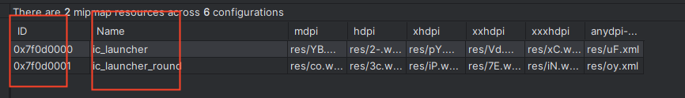

# Android App Size

## 分析 & 优化

- [Matrix-Android-ApkChecker分析工具](https://github.com/Tencent/matrix/wiki/Matrix-Android-ApkChecker)

### 拆包
- 动态下发(replugin、aab、[so](https://github.com/IMFWorks/Android-So-Handler))：dex、so、资源
- 分解业务(Gradle Product Flavor)：tv、watch、phone
    - 非核心做成bundle：log、qrcode
    - 按需下发资源bundle：splits

### Minify(Shrink缩减、Obfuscate混淆、Optimize优化)

#### Code Minify
代码的ProGuard或者R8是基于摇树优化(tree-shaking)进行缩减与字段简单命名进行混淆，除了缩减与混淆，我们还能进行代码的优化，基于redex和bytex能做R Filed内联、常量内联 、access 内联、方法删除等

- 有些代码没有被混淆
- R field内联
- sdk去重：Okhttp、Volley、Cronet ； Glide(500k) 与 Fresco(2-3M)

#### Resource Minify
资源缩减用清除无用资源、资源去重、png/webp/gif/jpg图片压缩、png/jpg转webp等方法,且混淆

- 文件去重：通过计算MD5值计算重复文件，然后修改resource.arsc资源位置。
- 无用res去除、无用assets去除
- 混淆：[安装包立减1M–微信Android资源混淆打包工具](https://mp.weixin.qq.com/s?__biz=MzAwNDY1ODY2OQ==&mid=208135658&idx=1&sn=ac9bd6b4927e9e82f9fa14e396183a8f#rd)

#### So Minify 
去除符号表、非必要去除exception库

- so(https://tech.meituan.com/2022/06/02/meituans-technical-exploration-and-practice-of-android-so-volume-optimization.html)
- 去除32位，GP强制要求上64位 so

#### 压缩
- 7zip压缩apk：有坑，内置apk安装不了，mmap so失败，内置的apk so必须不压缩
- png优化(更优压缩Pngquant 或者转webp)
- jpg优化(packJPG 和 guetzli 等工具)
- non-alpha png图片:对于不含alpha通道的png文件，可以转成jpg格式来减少文件的大小

### 技术选型

|   |matrix|booster|AGP
|--|--|--|--|
R field inline|  |☑️|
const inline  |  |   | 
access inline |  |   |
资源去重       |☑️|  | 
`无用res、assets资源删除`|☑️| | ☑️
`资源混淆`       |☑️| | ☑️
png优化(更优压缩Pngquant 或者转webp)||☑️|
gif优化| | | |
jpg优化| | | |
压缩           |☑️7-zip|☑️zip|

> AGP新资源缩减器(enableNewResourceShrinker)：7.1.0-alpha09试用，8.0正式使用
> AGP(enableResourceOptimizations): 4.2支持资源混淆

随着AGP支持与完善资源混淆与资源缩减的能力，matrix逐步被取代，与之相比较的booster框架在其扩展性表现优异且补足了AGP与matrix都不具备的优化能力，R field内联与png优化。所以选用booster框架并且在其基础能力上补足“资源去重”能力。  

#### 资源混淆 ：AGP 与 matrix方案对比

资源引用为两种getDrawable(R.mimap.icon_launcher) 和 getIdentifier(resName,resType)
R.mimap.icon_launcher 经过编译之后为0x7f0d0000，故getDrawable(R.mimap.icon_launcher)  等于 getDrawable(0x7f0d0000) 。而getIdentifier的resName参数微Name,所以混淆name要考虑getIdentifier情况

AGP 资源混淆较为保守只混淆res目录里的文件名字，而matrix较为激进不仅混淆res目录下的文件名字还混淆Name字段

实验数据

浏览器优化项|优化数据
--|--
去掉fresco|2-3M
R field inline|1.8m
png优化(更优压缩Pngquant 或者转webp)|1m
res去重|0.36m
res压缩|2m
assets去重|56.2k
assets压缩|
资源混淆|

## 包监控 与 代码提醒

- lint:少用枚举用@IntDef替代、AnimatedDrawable替换为AnimatedVectorDrawable

## 更多阅读

- [ProGuard and R8: Comparing Optimizers](https://www.guardsquare.com/blog/proguard-and-r8)
- [redex](https://github.com/facebook/redex)
- [ByteX](https://github.com/bytedance/ByteX)
- [Smaller APKs with resource optimization](https://jakewharton.com/smaller-apks-with-resource-optimization/)
- [Android App包瘦身优化实践](https://tech.meituan.com/2017/04/07/android-shrink-overall-solution.html)
- [缩减应用大小](https://developer.android.com/topic/performance/reduce-apk-size?hl=zh-cn)
- [性能优化：得物App包体积治理之路](https://mp.weixin.qq.com/s/1aAgY4OPnZl650Q8vD3LNA)
- [Booster](https://booster.johnsonlee.io/zh/guide/)
- [浅谈Android中的R文件作用以及将R资源inline减少包大小](https://yuweiguocn.github.io/android-r-inline/)
- [R 之初体验](https://medium.com/@morefreefg/%E5%85%B3%E4%BA%8E-r-%E7%9A%84%E4%B8%80%E5%88%87-355f5049bc2c)
- [Android对so体积优化的探索与实践](https://tech.meituan.com/2022/06/02/meituans-technical-exploration-and-practice-of-android-so-volume-optimization.html)
